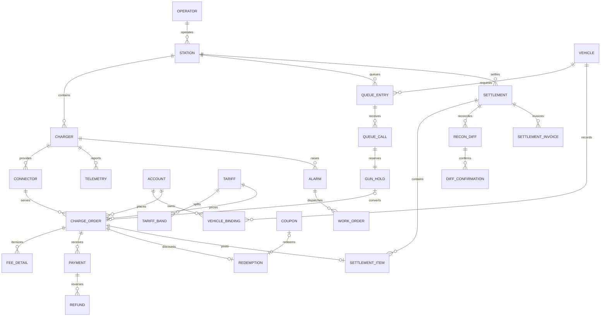

# 全局关系与建模说明

```mermaid
erDiagram
    OPERATOR ||--o{ STATION : operates
    STATION ||--o{ CHARGER : contains
    CHARGER ||--o{ CONNECTOR : provides
    CONNECTOR ||--o{ CHARGE_ORDER : serves
    STATION ||--o{ QUEUE_ENTRY : queues
    VEHICLE ||--o{ QUEUE_ENTRY : requests
    QUEUE_ENTRY ||--o{ QUEUE_CALL : receives
    QUEUE_CALL ||--|| GUN_HOLD : reserves
    GUN_HOLD o|--o| CHARGE_ORDER : converts
    ACCOUNT ||--o{ VEHICLE_BINDING : owns
    VEHICLE ||--o{ VEHICLE_BINDING : records
    ACCOUNT ||--o{ CHARGE_ORDER : places
    TARIFF ||--o{ TARIFF_BAND : splits
    TARIFF ||--o{ CHARGE_ORDER : prices
    CHARGE_ORDER ||--o{ FEE_DETAIL : itemizes
    CHARGE_ORDER ||--o{ PAYMENT : receives
    PAYMENT ||--o{ REFUND : reverses
    COUPON o|--o| REDEMPTION : redeems
    CHARGE_ORDER ||--o| REDEMPTION : discounts
    CHARGER ||--o{ TELEMETRY : reports
    CHARGER ||--o{ ALARM : raises
    ALARM ||--o{ WORK_ORDER : dispatches
    STATION ||--o{ SETTLEMENT : settles
    SETTLEMENT ||--o{ SETTLEMENT_ITEM : contains
    CHARGE_ORDER ||--o| SETTLEMENT_ITEM : posts
    SETTLEMENT ||--o{ RECON_DIFF : reconciles
    RECON_DIFF ||--o{ DIFF_CONFIRMATION : confirms
    SETTLEMENT ||--o{ SETTLEMENT_INVOICE : invoices
```

关系标识为各表主键。关键函数依赖包括枪 ID 决定桩 ID、桩 ID 决定场站 ID、站 ID 决定运营商 ID、订单 ID 决定车辆和成交费率版本、支付流水组合键决定收款记录。将场站地址、车辆规格、费用时段和支付流水独立存放，避免在订单中引入这些传递依赖。费用明细保存成交费率，结算明细保留入账快照。余额和订单账单总额属于受事务保护的汇总字段。
